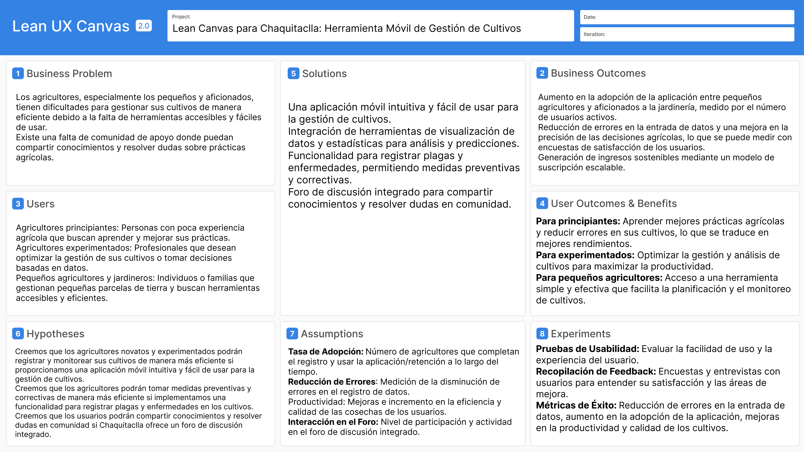

    <h3>Universidad Peruana de Ciencias Aplicadas</h3>
    </img> 
    <strong>Ingeniería de Software - 7mo Ciclo</strong> 
    <strong>Agile Project Management</strong> 
    <strong>1ASI0722-13287</strong> 
    <strong>Profesor: José Luis Vasquez Medina</strong> 
     <strong>Report</strong> 
     <strong>ChaquiTaclla</strong> 
    <strong>Error 404</strong>

<h3> Team Members: </h3>

| Member                              |    Code    |
| :---------------------------------- | :--------: |
|      Jimena Cama Salvatierra      | u202210778 |
| Sebastian Nicolas Cachis Gonzales | u202210846 |
|         Elias Yauri Paucar        | u202211817 |
|  Juan Fabritzzio Pescoran Angulo  | u20221c935 |
|  Adriano Sebastian Cruz Palomino  | u202210697 |
|  Lucio Heli Yen Cerna             | u202213143 |

<h3 align="center">Abril, 2025</h3>

  

## Registro de Versiones del Informe

El objetivo de esta sección es resumir las modificaciones relevantes que se realizan al informe durante el ciclo de vida del proyecto. Esta sección inicia en una página nueva e incluye un cuadro con la siguiente estructura:

| Version | Fecha      | Autor            | Descripción de modificación                                  |
|---------|------------|------------------|--------------------------------------------------------------|
| 1.0     | 14/04/2025 | Jimena Cama      | Documentación de la descripción de la startup del Capitulo 1 |
| 1.1     | 14/04/2025 | Sebastián Cachis | Documentación de segmentos objetivos                         |
| 1.2     | 14/04/2025 | Elias Yauri      | Documentación de Propuesta de valor                          |
| 1.3     | 15/04/2025 | Adriano Cruz     | Actualización de la Propuesta de Valor                       |
| 1.4     | 15/04/2025 | Juan Pescoran    | Definición de los antecedentes y problemática                |

# Contenido

## [Capítulo I: Introducción](#capítulo-i-introducción)
- [1.1. Startup Profile](#11-startup-profile)
  - [1.1.1. Descripción de la Startup](#111-descripción-de-la-startup)
  - [1.1.2. Perfiles de integrantes del equipo](#112-perfiles-de-integrantes-del-equipo)
- [1.2. Solution Profile](#12-solution-profile)
  - [1.2.1. Antecedentes y problemática](#121-antecedentes-y-problemática)
  - [1.2.2. Propuesta de valor](#122-propuesta-de-valor)
- [1.3. Segmentos objetivo](#13-segmentos-objetivo)
## [Conclusiones y recomendaciones](#conclusiones-y-recomendaciones)
## [Video About-the-Team](#video-about-the-team)
## [Bibliografía](#bibliografía)
## [Anexos](#anexos)

 

# Student Outcome

<table>
    <thead>
        <tr>
            <th><b>Criterio específico</b></th>
            <th><b>Acciones realizadas</b></th>
            <th><b>Conclusiones</b></th>
        </tr>
    </thead>
    <tbody>
        <tr>
            <td rowspan="1"><b>Diseña productos o componentes en ingeniería de software que satisfacen necesidades específicas considerando el impacto en salud pública, seguridad, bienestar, así como factores globales, culturales, sociales, ambientales y económicos.</b></td>
            <td>
                <b>Jimena Cama Salvatierra</b> 
                TB1: Diseñé componentes de software centrados en la accesibilidad y usabilidad para agricultores con diversos niveles de alfabetización digital. 
                 
                <b>Sebastian Nicolas Cachis Gonzales</b> 
                TB1:  
                 
                <b>Elias Yauri Paucar</b> 
                TB1: Participé en la planificación y diseño de los módulos de la aplicación Chaquitaclla, asegurando que las funcionalidades respondan a las necesidades de los agricultores y promuevan su bienestar         mediante el acceso a información relevante, considerando su contexto social y económico.  
                 
                <b>Juan Fabritzzio Pescoran Angulo</b> 
                TB1: Participé en el diseño de una interfaz amigable para la app Chaquitaclla, enfocándome en que los elementos visuales y de navegación sean intuitivos para usuarios con experiencia tecnológica limitada, promoviendo así una mayor inclusión digital en zonas rurales.  
                <b>Adriano Sebastian Cruz Palomino</b> 
                TB1: Colaboré en la planificación y definición de los módulos de la aplicación Chaquitaclla, enfocándome en que las funcionalidades permitan a los agricultores acceder a información útil   
                <b>Lucio Heli Yen Cerna</b> 
                TB1:  
                </td>
            <td rowspan="1">
                TB1: [Conclusiones Grupales] 
                </td>
        </tr>
        <tr>
            <td rowspan="1"><b>Diseña proyectos que permiten la implementación de soluciones en ingeniería de software considerando el impacto en salud pública, seguridad, bienestar, así como factores globales, culturales, sociales, ambientales y económicos.</b></td>
            <td>
                <b>Jimena Cama Salvatierra</b> 
                TB1: Desarrollé un marco de trabajo para Chaquitaclla que integra prácticas sostenibles de agricultura con tecnología accesible, diseñando la arquitectura del sistema para funcionar en entornos con conectividad intermitente. 
                 
                 
                <b>Sebastian Nicolas Cachis Gonzales</b> 
                TB1: 
                 
                 
                <b>Elias Yauri Paucar</b> 
                TB1: Colaboré en la fase inicial de estructuración del proyecto Chaquitaclla, aportando a que la solución propuesta fuera viable y sensible a las realidades culturales y económicas de los pequeños agricultores, promoviendo así un impacto positivo en su bienestar y desarrollo sostenible.
                 
                 
                <b>Juan Fabritzzio Pescoran Angulo</b> 
                TB1: Contribuí en la elaboración del plan técnico del proyecto Chaquitaclla, proponiendo soluciones escalables que puedan adaptarse tanto a comunidades con infraestructura limitada como a aquellas con mejores recursos, siempre considerando las realidades socioeconómicas del entorno agrícola.
                 
                 
                <b>Adriano Sebastian Cruz Palomino</b> 
                TB1:Participé en la estructuración inicial del proyecto Chaquitaclla, contribuyendo a que la propuesta sea viable para pequeños agricultores y adaptable a sus contextos culturales y económicos. 
                 
                 
                <b>Lucio Heli Yen Cerna</b> 
                TB1:  
                </td>
            <td rowspan="1">
                 TB1: [Conclusiones Grupales Pendientes] 
                </td>
        </tr>
        <tr>
            <td rowspan="1"><b>Diseña y ejecuta los procesos relacionados al desarrollo y mantenimiento de la solución de software en ingeniería considerando el impacto en salud pública, seguridad, bienestar, así como factores globales, culturales, sociales, ambientales y económicos.</b></td>
            <td>
                <b>Jimena Cama Salvatierra</b> 
                TB1: Implementé metodologías ágiles adaptadas al contexto agrícola para el desarrollo de Chaquitaclla, estableciendo ciclos de retroalimentación con agricultores de diversas regiones y niveles tecnológicos.  
                 
                <b>Sebastian Nicolas Cachis Gonzales</b> 
                TB1:  
                 
                <b>Elias Yauri Paucar</b> 
                TB1: Contribuí a la implementación de metodologías ágiles en el contexto agrícola, asegurando que la aplicación Chaquitaclla se mantuviera en mejora continua de acuerdo con las sugerencias y necesidades de los agricultores, favoreciendo así su bienestar y adaptabilidad a sus condiciones sociales y económicas.  
                 
                <b>Juan Fabritzzio Pescoran Angulo</b> 
                TB1: Diseñé flujos de trabajo para el mantenimiento de la aplicación, considerando aspectos de sostenibilidad tecnológica y la posibilidad de soporte remoto, priorizando la continuidad operativa en regiones con baja conectividad.  
                <b>Adriano Sebastian Cruz Palomino</b> 
                TB1:Colaboré en la integración de metodologías ágiles para el entorno agrícola, garantizando que Chaquitaclla se actualice constantemente según las sugerencias y necesidades de los agricultores.   
                <b>Lucio Heli Yen Cerna</b> 
                TB1:  
                </td>
            <td rowspan="1">
                 TB1: [Conclusiones Grupales Pendientes] 
                </td>
        </tr>
    </tbody>
</table>

# Capítulo I: Introducción

## 1.1. Startup Profile

En este apartado se ofrece una descripción de la startup y los perfiles de los integrantes del equipo.

### 1.1.1. Descripción de la Startup

Chaquitaclla es una aplicación móvil integral que transforma la gestión agrícola, que a diferencia de las soluciones tradicionales enfocadas en grandes corporaciones, nosotros democratizamos la tecnología agrícola haciéndola accesible para todos los agricultores, desde novatos hasta expertos.
Una plataforma móvil que permite gestionar cultivos de manera eficiente desde cualquier smartphone. Ofrecemos monitoreo en tiempo real los ciclos fenológicos de cada cultivo, manteniendo un registro histórico, que ayuda a identificar los periodos óptimos para siembra y cosecha. Esto garantiza una trazabilidad completa y apoya a nuestros usuarios en alcanzar sus metas agrícolas, todo desde la comodidad de su dispositivo móvil.
En esencia, buscamos revolucionar el sector agrícola mediante una aplicación intuitiva y accesible que promueva el éxito de todos nuestros usuarios.

**Misión:** Ofrecer una solución integral para la administración agrícola que rompa con las limitaciones tradicionales, siendo accesible para agricultores de todos los niveles, directamente desde sus dispositivos móviles.

**Visión:** Posicionarnos como la aplicación líder en gestión agrícola en los próximos años, distinguiéndonos por nuestra facilidad de uso y accesibilidad. Como startup, Error 404 aspira a consolidarse como un equipo autosustentable, reconocido por desarrollar soluciones innovadoras para la agricultura moderna.

### 1.1.2. Perfiles de integrantes del equipo

<table>
  <tr align="center">
    <td rowspan="4">
      
    </td>
    <td align="left">
      <b>Nombre y Apellido:</b>
                   
      Sebastian Nicolas Cachis Gonzales
    </td>
  </tr>
  <tr>
    <td align="left">
    <b>Código:</b>
     
    U202210846
    </td>
  </tr>
  <tr>
    <td align="left">
    <b>Carrera:</b>
     
    Ingeniería de Software
    </td>
  </tr>
  <tr>
    <td align="left">
    <b>Acerca de:</b>
     
    Soy estudiante de séptimo ciclo de ingeniería de software en la UPC. Me considero una persona proactiva, organizada, meticulosa y muy enfocada en mis estudios, tanto grupales como individuales. Tengo facilidad para entender y ejemplificar los distintos temas que vemos, teniendo soltura para explicar.
    </td>
  </tr>
  <tr align="center">
    <td rowspan="4">
      
    </td>
    <td align="left">
      <b>Nombre y Apellido:</b>
                   
      Elias Yauri Paucar
    </td>
  </tr>
  <tr>
    <td align="left">
    <b>Código:</b>
     
    U202211817
    </td>
  </tr>
  <tr>
    <td align="left">
    <b>Carrera:</b>
     
    Ingeniería de Software
    </td>
  </tr>
  <tr>
    <td align="left">
    <b>Acerca de:</b>
     
    Mi nombre es Elias Yauri, soy una persona muy participativa cuando se trata en el tema laboral y en el trabajo en equipo, siempre trato que haya una comunicación constante con todos los miembros del grupo para de esta forma poder tener todos una buena afinidad como grupo y que el trabajo se realice de manera exitosa. 
    </td>
  </tr>
   <tr align="center">
    <td rowspan="4">
      
    </td>
    <td align="left">
      <b>Nombre y Apellido:</b>
                   
      Jimena Tamara Cama Salvatierra
    </td>
  </tr>
  <tr>
    <td align="left">
    <b>Código:</b>
     
    U2022210778
    </td>
  </tr>
  <tr>
    <td align="left">
    <b>Carrera:</b>
     
    Ingeniería de Software
    </td>
  </tr>
  <tr>
    <td align="left">
    <b>Acerca de:</b>
     
     Soy estudiante de la carrera de Ingeniería de Software en la UPC y actualmente estoy cursando el 7mo ciclo. Me considero una persona curiosa, determinada y organizada. Con la experiencia en proyectos de startup y trabajos en equipo, trabajaré junto a mis compañeros para lograr un óptimo resultado del proyecto.
    </td>
  </tr>
  <tr align="center">
    <td rowspan="4">
      
    </td>
    <td align="left">
      <b>Nombre y Apellido:</b>
                   
      Adriano Sebastian Cruz Palomino
    </td>
  </tr>
  <tr>
    <td align="left">
    <b>Código:</b>
     
    U202210697
    </td>
  </tr>
  <tr>
    <td align="left">
    <b>Carrera:</b>
     
    Ingeniería de Software
    </td>
  </tr>
  <tr>
    <td align="left">
    <b>Acerca de:</b>
     
    Mi nombre es Adriano Sebastian Cruz Palomino, tengo 20 años, soy alumno de Ingeniería de Software en la UPC, actualmente estoy cursando el 7mo ciclo. Soy una persona curiosa, responsable, y comprometida con mis estudios, siempre busco aprender más y mejorar mis habilidades.
    </td>
  </tr>
  <tr align="center">
    <td rowspan="4">
      
    </td>
    <td align="left">
      <b>Nombre y Apellido:</b>
                   
      Juan Fabritzzio Pescoran Angulo
    </td>
  </tr>
  <tr>
    <td align="left">
    <b>Código:</b>
     
    U20221C936
    </td>
  </tr>
  <tr>
    <td align="left">
    <b>Carrera:</b>
     
    Ingeniería de Software
    </td>
  </tr>
  <tr>
    <td align="left">
    <b>Acerca de:</b>
     
    Hola que tal, soy Juan Pescoran, tengo 19 años, estoy llevando la carrera de Ingenieria de Software en la UPC, voy en el 7mo ciclo. Me considero una persona responsable, puntual y comprometida con mis estudios. Me gusta aprender cosas nuevas y siempre estoy dispuesto a ayudar a mis compañeros.
    </td>
  </tr>
    <tr align="center">
    <td rowspan="4">
      
    </td>
    <td align="left">
      <b>Nombre y Apellido:</b>
                   
      Lucio Heli Yen Cerna
    </td>
  </tr>|
  <tr>
    <td align="left">
    <b>Código:</b>
     
    U202213143
    </td>
  </tr>
  <tr>
    <td align="left">
    <b>Carrera:</b>
     
    Ingeniería de Software
    </td>
  </tr>
  <tr>
    <td align="left">
    <b>Acerca de:</b>
     
    Soy estudiante del séptimo ciclo de la carrera de Ingeniería de Software en la UPC. Me considero una persona responsable, dedicada y autodidacta. Me gusta crear un gran ambiente laboral que nos genere a todos los miembros de mi equipo una gran motivación para lograr nuestros objetivos con creces.   
    </td>
  </tr>
</table>

## 1.2. Solution Profile

### 1.2.1. Antecedentes y problemática

Para conocer mejor el problema que queremos resolver, utilizamos la técnica de los 5W2H, que nos ayuda a identificar y analizar los aspectos clave del problema. A continuación, se presentan las preguntas y respuestas correspondientes:

¿Qué? (What)
¿Cuál es el problema?  
El problema radica en la ausencia de una herramienta accesible para el público general que permita gestionar, monitorear y seguir el progreso de sus cultivos desde un dispositivo móvil. Las soluciones disponibles actualmente están orientadas principalmente a grandes empresas y no a individuos o pequeños agricultores, lo que crea una brecha en el mercado para quienes necesitan una herramienta práctica y fácil de usar. Aunque existe información online sobre el manejo de cultivos, encontrar fuentes confiables y organizar esa información puede resultar tedioso y consumir mucho tiempo, lo cual no es ideal para quienes buscan eficiencia.

¿Cuándo? (When)
¿Cuándo ocurre el problema?  
Este desafío surge cuando los agricultores, ya sean novatos o expertos, necesitan una herramienta que les permita gestionar eficazmente sus cultivos, considerando factores como las condiciones climáticas, las etapas de crecimiento y las mejores épocas para sembrar y cosechar. Lamentablemente, las soluciones existentes están enfocadas en grandes empresas y no son accesibles para todos los agricultores.

¿Dónde? (Where)
¿A quién va dirigida nuestra solución?  
Nuestra solución está destinada a cualquier persona interesada en la gestión agrícola, sin importar su experiencia previa, que busque una herramienta moderna, sencilla y accesible para gestionar sus cultivos desde su móvil.
¿Dónde surge el problema?
El problema aparece durante el ciclo de crecimiento de los cultivos, desde la siembra hasta la cosecha. La falta de una gestión adecuada puede llevar a pérdidas de calidad, rendimientos bajos o incluso la pérdida total de la cosecha debido a factores que podrían haberse evitado con un monitoreo más riguroso.

¿Quién? (Who)
¿Quiénes están involucrados? ¿Quién usará el producto?  
Los usuarios principales de la aplicación serán agricultores novatos, entusiastas de la jardinería y pequeños productores que buscan gestionar mejor sus cultivos. Esto incluye tanto a profesionales del sector agrícola como a personas que cultivan huertos en casa y buscan una herramienta fácil de usar para monitorear y mejorar el crecimiento de sus plantas.

¿Por qué? (Why)
¿Cuál es la causa del problema?  
El principal reto es introducir una solución tecnológica en un sector agrícola tradicionalmente dominado por métodos convencionales. Muchos agricultores, sobre todo en áreas rurales, están acostumbrados a usar herramientas tradicionales, lo que provoca resistencia a adoptar nuevas tecnologías. Además, los agricultores principiantes pueden sentirse abrumados por la variedad de opciones disponibles y desconfiar de su efectividad. El reto es crear una aplicación móvil que sea vista como una solución confiable y fácil de usar, que demuestre su valor desde el primer uso.

¿Cómo? (How)
¿Cómo se usará el producto?  
El producto se utilizará para registrar y monitorear los cultivos desde la siembra hasta la cosecha. Los usuarios podrán introducir detalles de sus cultivos, como el tipo de planta, la etapa de crecimiento y las condiciones ambientales. La aplicación ofrecerá recomendaciones personalizadas según el estado del cultivo, ayudando a los usuarios a mejorar la calidad y rendimiento de sus cosechas.
¿Cómo se logrará una gestión adecuada de los cultivos dentro de la aplicación móvil?
Los usuarios podrán acceder a la aplicación desde sus dispositivos móviles, registrar manualmente la información de sus cultivos y recibir consejos específicos adaptados a las necesidades de cada planta. La app usará esta información para generar recomendaciones y alertas sobre cuándo realizar tareas como riego, fertilización o cosecha, lo que garantizará una gestión más eficiente y efectiva.

¿Cuánto? (How much)
¿Cuál es la magnitud del problema?  
Según estudios recientes, solo una pequeña parte del sector agrícola ha adoptado tecnologías avanzadas para la gestión de cultivos. Esto es especialmente problemático en áreas rurales y países en desarrollo, donde la falta de acceso a herramientas tecnológicas limita el potencial productivo y afecta negativamente la calidad de vida de los agricultores. Si nuestra aplicación móvil logra una amplia adopción, podría beneficiar a un gran número de agricultores que hoy carecen de herramientas modernas, mejorando sustancialmente sus prácticas y resultados agrícolas.
¿Qué porcentaje de la industria agrícola se vería beneficiado por nuestro producto?
Si nuestra aplicación tiene éxito, podría impactar positivamente a una gran mayoría de pequeños agricultores y aficionados a la jardinería que aún no utilizan tecnología para gestionar sus cultivos. Esto incluiría tanto a personas en áreas urbanas como rurales, con el potencial de mejorar la calidad de los productos agrícolas y optimizar la gestión de los cultivos.

### 1.2.2. Propuesta de valor

### Problema a Resolver  

Los agricultores, especialmente los pequeños y aficionados, tienen dificultades para gestionar sus cultivos de manera eficiente debido a la falta de herramientas accesibles y fáciles de usar. Existe una falta de comunidad de apoyo donde puedan compartir conocimientos y resolver dudas sobre prácticas agrícolas.

### Posibles Usuarios  
- **Agricultores principiantes:** Personas con poca experiencia agrícola que buscan aprender y mejorar sus prácticas agrícolas con herramientas intuitivas.
- **Agricultores experimentados:** Profesionales que desean optimizar la gestión de sus cultivos mediante decisiones basadas en datos y análisis sistematizados.
- **Pequeños agricultores y jardineros:** Individuos o familias que gestionan pequeñas parcelas de tierra y necesitan soluciones tecnológicas accesibles y eficientes para maximizar sus resultados.

### Objetivos del Startup  
- Aumentar la adopción de la aplicación entre pequeños agricultores y aficionados a la jardinería, medido por el crecimiento en usuarios activos.
- Reducir errores en la entrada de datos agrícolas y mejorar la precisión de las decisiones, verificable mediante encuestas de satisfacción.
- Fomentar la creación de una comunidad activa donde los usuarios compartan conocimientos y resuelvan dudas colectivamente.
- Generar ingresos sostenibles implementando un modelo de suscripción escalable que aporte valor diferencial.

### Beneficios para los Usuarios  
- **Principiantes:** Acceso a mejores prácticas agrícolas que reducen errores en sus cultivos, traduciendo el aprendizaje en mejores rendimientos desde las primeras cosechas. 
- **Experimentados:** Herramientas de gestión y análisis de cultivos que maximizan la productividad mediante visualización de datos y estadísticas para predicciones más precisas. 
- **Pequeños agricultores:** Acceso a una plataforma simple pero efectiva que simplifica la planificación y el monitoreo continuo de cultivos, adaptada a las necesidades específicas de espacios reducidos.

## 1.3. Segmentos objetivo  

En el ámbito de la agricultura y tecnología, es fundamental identificar segmentos objetivo precisos para abordar necesidades específicas. Nuestro producto se dirige a dos segmentos clave:

- **Agricultores Profesionales:** Este segmento incluye a agricultores de países desarrollados y en desarrollo que se dedican a la agricultura como su actividad principal. Aunque la adopción de herramientas digitales es más alta en países desarrollados, hay una tendencia creciente entre los agricultores en países en desarrollo para usar tecnología para mejorar la productividad. Sin embargo, los agricultores en países en desarrollo pueden enfrentar barreras como acceso limitado a internet o falta de habilidades técnicas. A nivel global, este segmento busca soluciones que les permitan gestionar sus cultivos de manera eficiente, reducir pérdidas y aumentar la productividad. 

- **Jardineros en casa o aficionados a la Agricultura:** Este segmento está compuesto por personas que practican la agricultura como hobby o en pequeña escala. Aunque tienen un creciente interés en herramientas digitales para mejorar sus prácticas agrícolas, a menudo prefieren enfoques tradicionales y pueden ser reacios a adoptar nuevas tecnologías. Necesitan aplicaciones que sean fáciles de usar y que proporcionen información clara y accesible para respaldar sus actividades agrícolas.

# Conclusiones  
## Conclusiones y recomendaciones  

# Video About-the-Team  

# Bibliografía  

<i>Ribeiro, A., & Machado, S. (2021). <b>Agricultural technology: Innovation and sustainability. Springer.</b>

Bello, E., & Arregui, I. (2022). <b>Tecnologías emergentes para la agricultura digital: Perspectivas para pequeños productores. Editorial Universitaria.</b>

López, R., & González, M. (2021). <b>Agricultura inteligente: Tecnologías para el futuro del campo. Universidad Politécnica de Valencia.</b>

FAO. (2022). <b>Digital agriculture: A conceptual framework for the integration of digital technologies in the agricultural sector. Organización de las Naciones Unidas para la Alimentación y la Agricultura.</b> Recuperado de https://www.fao.org/digital-agriculture/en/

World Bank. (2023). <b>Agriculture and technology: A new era of digital transformation. Banco Mundial.</b> Recuperado de https://www.worldbank.org/en/topic/agriculture

Méndez, D., & Hernández, J. (2023). <b>El impacto de la digitalización en la agricultura: Un análisis de las plataformas móviles para la gestión agrícola.</b> Revista de Agricultura y Desarrollo, 15(3), 45-56.

Martínez, A., & Pérez, F. (2022). <b>Las aplicaciones móviles en la agricultura: Retos y oportunidades para los pequeños productores.</b> Journal of Agricultural Technology, 18(5), 1201-1215.

AgFunder Network Partners. (2021). <b>The rise of AgTech: Digital solutions for sustainable agriculture. AgFunder Network.</b> Recuperado de https://agfundernetwork.com

Vásquez, P., & Gutiérrez, J. (2023). <b>Agricultura digital y el uso de la inteligencia artificial: Hacia la mejora de la eficiencia agrícola. Revista Digital Agricultura.</b> Recuperado de https://www.revistadigitalagricultura.com

Agricultural Technology for Development. (2023). <b>Evaluating the adoption of digital technologies by smallholder farmers. Recuperado de https://www.agtechfordevelopment.org

Google Developers. (2024). <b>Guía de diseño de interfaces para aplicaciones móviles en Android.</b> Recuperado de https://developer.android.com/design </i>

# Anexos  
